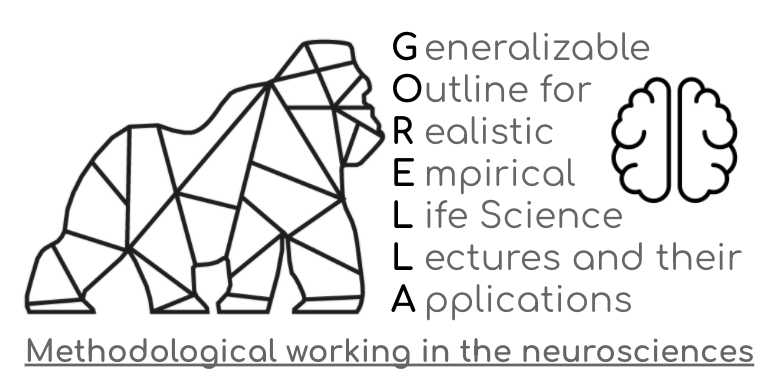

## "What's in this repository?"

This repository contains the G0RELLA module "Methodological work in imaging neuroscience" which was conducted at UMR during the summer term 2021.

We've tried to document the various aspects of this G0RELLA module with a whole bunch of README files, so feel free to jump around and check things out.

This module follows the idea of specific G0RELLA projects. More precisely, as all other modules it should have the same general setup to increase openness, interoperability, reproducibility and transparency.
In order to make this as easy and standardized as possible, we adapted the basic skeleton to the current form. With that, interested
folks that plan to conduct similar courses can simply fork this repository and fill it with their own content.
A corresponding tutorial is available [here]() in the general [G0RELLA docs](). 

## "I have some questions..."

[Open an issue]() on this repository and someone will try and get back to you as soon as possible!
