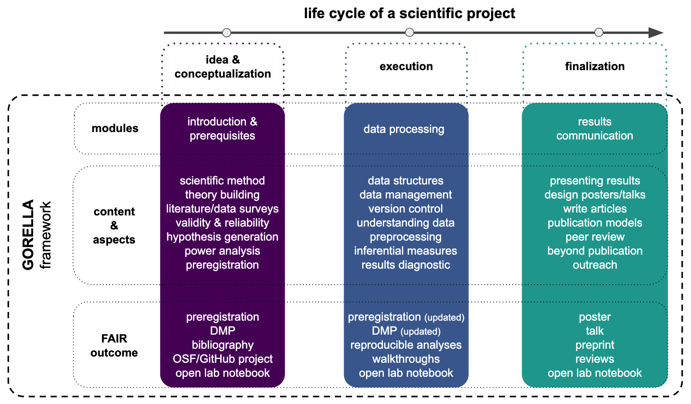

# General outline

The following diagram shows the application of the GORELLA framework to the
life cycle of a scientific project. This includes the collection of ideas and
conceptualization, followed by execution and finalization of the project.

The GORELLA framework is thus sub-divided into modules that fit the
aforementioned project steps. As an example for a lecture focused on
neuroscience research, we provide a set of contents and outcomes for each of
the modules as a basis for the practical implementation of the framework.
 

The general life cycle of a scientific project is divided into different steps (*idea & conceptualization*, *execution* and *finalization*).
The focus of the first step *idea & conceptualization* is finding a research question and define what is needed to realize this. The GORELLA module for this step is called **introduction & prerequisites**. This module builds the base for realizing a project. As a main aspect the open science methods were introduced. Based on them the followed steps like theory building, literature & data search, validity & reliability, generate hypothesis and perform a power analysis are introduced and were combined in a preregistration of the project. On top a data management plan, project plan and bibliography are created and are presented online on OSF or GitHub. For documentation purpose an open lab notebook is used.

The second step of the life cycle deals with the *execution* of the project. The corresponding GORELLA module is called **data processing**. In this module the standardized data structure BIDS is presented and how this can be managed. Another important aspect is to understand the data which is used in the project and that everything is version controlled. Based on the hypothesis the analysis is performed including the statistics The outcome of this module is the updated preregistration, data management plan and the lab notebook as well as reproducible analyses, walkthroughs (for reproducibility).

The third step is the *finalization* of the project. In the GORELLA framework this module is called **results & communication**. This includes the preparation for presenting the results in a poster session or for a talk, including the design of the poster/talk. The writing and publication of an article is also presented and performed. The course members perform a peer review on the other projects. As a last step an introduction what happens beyond the publication is also shown. So the outcome is a poster, talk, preprint and a peer review as well as the update of the open lab notebook.

All the outcome will be available online and for everybody accessible based on the FAIR concept.

